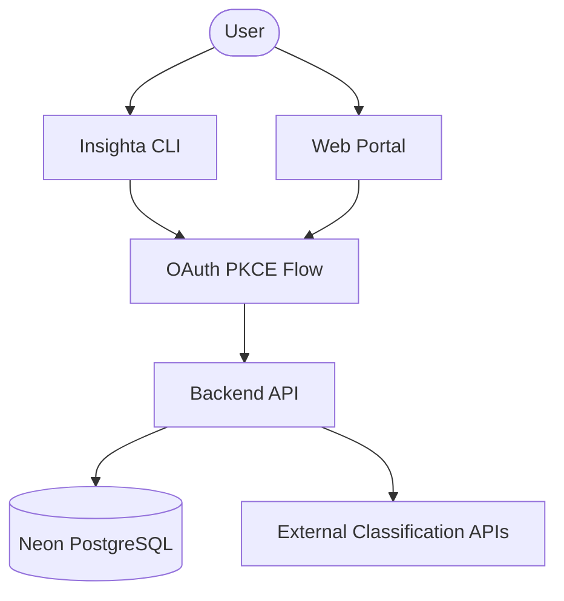

# Insighta Labs+ | Profile Intelligence API

The core backend for Insighta Labs+, a secure, multi-interface platform for identity profile classification and analysis.

## 🏗 System Architecture

Insighta Labs+ follows a **3-tier modular architecture** designed for scalability and security:

1.  **Backend (FastAPI)**: The central source of truth. Handles data ingestion, classification (via External APIs), identity management, and RBAC.
2.  **CLI (TypeScript)**: A power-user interface for automated querying and profile management.
3.  **Web Portal (Next.js 14)**: A secure, browser-based interface for non-technical analysts.



---

## 🔐 Authentication & PKCE Flow

Insighta Labs+ utilizes **GitHub OAuth with PKCE** (Proof Key for Code Exchange) to ensure secure sessions across both public (CLI) and private (Web) clients.

### CLI Flow (PKCE)
1.  **Challenge Generation**: CLI generates a random `code_verifier` and a `code_challenge`.
2.  **Authorization**: CLI opens the browser to `GET /auth/github` with the challenge.
3.  **Callback**: GitHub redirects to the CLI's local server.
4.  **Exchange**: CLI sends the `code` and `code_verifier` to `POST /auth/github/callback`.
5.  **Verification**: Backend verifies the challenge and issues JWTs.

### Web Flow
1.  **Authorization**: Browser redirects to `GET /auth/github`.
2.  **Exchange**: Backend handles the callback, sets **HTTP-only, SameSite:Strict cookies**, and redirects to the dashboard.

---

## 🎫 Token Handling Approach

The system enforces strict session security using a **Dual-Token Rotation Strategy**:

| Token | Type | Expiry | Storage |
| :--- | :--- | :--- | :--- |
| **Access Token** | JWT | 3 Minutes | Memory / HTTP-only Cookie |
| **Refresh Token** | Secure Hash | 5 Minutes | Database / HTTP-only Cookie |

### Rotation Logic
On every refresh (`POST /auth/refresh`):
1.  The provided refresh token is verified against the database.
2.  **Immediate Invalidation**: The old refresh token is marked as `revoked`.
3.  **New Issuance**: A brand new pair of access/refresh tokens is generated and returned/set.

---

## 🛡 Role Enforcement Logic

Access control is centralized via **FastAPI Dependency Injection**, preventing scattered `if/else` checks.

- **Admin**: Full read/write/delete access. Required for `POST /api/profiles` and `DELETE`.
- **Analyst**: Read-only access. Restricted to querying and searching.

```python
# app/core/dependencies.py
async def require_admin(current_user: User = Depends(get_current_user)) -> User:
    if current_user.role != "admin":
        raise HTTPException(status_code=403, detail="Admin access required")
    return current_user
```

---

## 🧠 Natural Language Parsing Approach

The Search Engine utilizes a **Rule-Based Deterministic Parser** (`app/core/parser.py`) to interpret plain English intent:

1.  **Normalization**: Queries are lowercased and stripped of noise.
2.  **Pattern Matching**: Regex-based extraction of:
    - **Demographics**: "teenagers", "seniors", "young".
    - **Gender**: "male", "female".
    - **Geographics**: "from [Country Name]" matching against a 90+ country map.
3.  **Filter Construction**: Patterns are mapped to SQL query parameters (e.g., `above 30` → `min_age=30`).

---

## 💻 CLI Usage

The Insighta CLI provides a high-performance interface for engineers.

| Command | Action |
| :--- | :--- |
| `insighta login` | Secure GitHub PKCE Authentication |
| `insighta whoami` | Verify current session and role |
| `insighta profiles list` | Paginated profile retrieval with filters |
| `insighta profiles search "query"` | Natural Language Querying |
| `insighta profiles create --name "X"` | New profile classification (Admin) |
| `insighta profiles export --format csv` | Local CSV download to current directory |

---

## 🚀 Installation & Deployment

### Environment Setup
Create a `.env` file:
```env
DATABASE_URL=postgresql+asyncpg://...
GITHUB_CLIENT_ID=...
GITHUB_CLIENT_SECRET=...
GITHUB_REDIRECT_URI=...
JWT_SECRET_KEY=...
FRONTEND_URL=...
```

### Run Locally
```bash
# Install dependencies
pip install -r requirements.txt

# Create tables
python scripts/create_tables.py

# Start server
uvicorn app.main:app --reload
```
